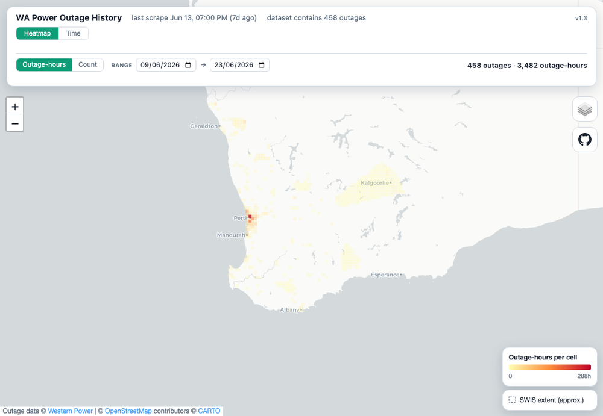
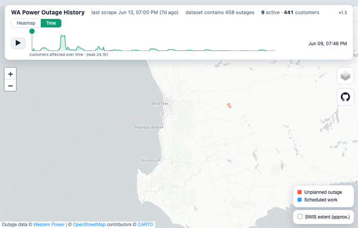

# Lights Out — WA Power Outage History

### 🔦 **[Open the live map →](https://wrignj08.github.io/lights-out/)**

A growing history of power outages on WA's main grid. Western Power publishes a
**live** outage map but keeps **no history of its own** — this project has been
mirroring its data feed every few minutes since **9 June 2026**, building a
record you can scrub back through to see where the power has been out. It only
covers outages from that start date onward (see [Scope & coverage](#scope--coverage)).



> **Unofficial / non-commercial.** A personal, public-interest project — **not
> affiliated with, endorsed by, or connected to Western Power**. Outage data
> © Western Power, mirrored here for transparency and research. See
> [Data & licence](#data--licence).

## Using the map



Two modes, switched with the tabs at the top:

- **Heatmap** *(default)* — an on-the-fly grid over a chosen date range,
  coloured by **total outage-hours** or **outage count**. The grid resolution
  scales with zoom (10 km → 50 m) and re-bins to the visible area, so it stays
  smooth as you pan and zoom.
- **Time** — every outage drawn as a polygon (**red = unplanned**, **blue =
  scheduled**), with a slider + ▶ play to scrub through history and a sparkline
  of customers affected over time. Scheduled works only appear during their
  planned window.

It also:

- **Remembers state in the URL** — centre, zoom, mode, basemap and layer
  toggles live in the address bar, so a refresh or a shared link lands on the
  same view.
- **Auto-refreshes** — picks up newly-published snapshots in place, no reload;
  the top bar shows how long ago the last scrape was.
- **Layers** *(top-right)* — CARTO light / Esri satellite basemaps, an
  approximate SWIS-extent outline, and an Overture buildings overlay (when
  zoomed in).
- **Follows your OS dark/light theme.**

## Scope & coverage

> **SWIS only.** This covers **only** Western Power's South West Interconnected
> System (the south-west of WA — roughly Kalbarri to Kalgoorlie to Albany). It
> does **not** include Horizon Power's regional and remote networks (the rest of
> the state), which aren't in this feed.

> **History from 9 June 2026.** Collection began on this date; there is no data
> before it (the live feed carries no history of its own).

## Caveats

- Captures only outages the public feed exposes (active outages ≥ the map's
  reporting threshold); very brief or sub-threshold outages may never appear.
- Duration resolution = the gap between snapshots. The scraper is *scheduled*
  every 10 min, but GitHub Actions delays and skips runs, so in practice
  snapshots land a **mean of ~40 min apart** (median ~10 min, occasionally
  several hours). An outage shorter than the gap to the next snapshot may be
  caught in a single snapshot (duration shown as 0) or missed entirely.
- `OUTAGESTARTTIME` / `ESTIMATEDRESTORATIONTIME` are Western Power's own values;
  `first_seen` / `last_seen` are when *we* observed it.
- Cause/reason is not in the live feed.

## How it's built

The live map is backed by a public, unauthenticated ArcGIS Feature Service that
only ever lists **currently active** outages. We snapshot it on a schedule and
commit each change, so **git history becomes a time machine** — an outage's full
life is reconstructed from the sequence of snapshots it appears in.

```
scrape.py        Fetch every current outage -> data/current.geojson
                 (sorted, OBJECTID stripped, stable formatting so an unchanged
                  map = unchanged file = no commit)

run.sh           scrape.py, then commit ONLY if current.geojson changed.
                 The commit timestamp is the authoritative "observed at" time.

build_events.py  Walk the git history of current.geojson and emit:
                   data/events.csv      one row per outage
                   data/events.geojson  one polygon per outage + metadata
```

`data/current.geojson` is the versioned live mirror. `data/events.*` are derived
artefacts — not committed (see `.gitignore`); rebuild any time.

It runs itself on **GitHub Actions**
([`.github/workflows/scrape.yml`](.github/workflows/scrape.yml)) every 10
minutes: scrape, commit on change, rebuild `events.geojson`, and deploy the
viewer to GitHub Pages. (GitHub may delay scheduled runs under load; 10 minutes
is a safe cadence.)

### Run it yourself

```bash
# rebuild the derived events from git history, then serve the viewer
python3 build_events.py
python3 -m http.server 8000      # open http://localhost:8000/map.html
```

To keep scraping on your own host, run `run.sh` on a timer, e.g. cron:

```cron
*/10 * * * * cd /path/to/lights-out && ./run.sh >> scraper.log 2>&1
```

You can also drop `data/events.geojson` into QGIS or onto <https://geojson.io>.

<details>
<summary><strong>Feed fields</strong> (per outage, "Outage_Area")</summary>

Endpoint:
`https://services2.arcgis.com/tBLxde4cxSlNUxsM/ArcGIS/rest/services/WP_Outage_Prod/FeatureServer/0`

| Field | Meaning |
|---|---|
| `INCIDENTREF` | Stable incident id (e.g. `INCD-2010301-U`) — tracks one outage over time |
| `OUTAGETYPE` | Internal type code: **`U` = unplanned (active), `F` = future scheduled work, `P` = planned** |
| `PLANNEDOUTAGE` | `Planned` / `Unplanned` — **unreliable; ignore it** (it labels every `F` as "Unplanned") |
| `OUTAGESTARTTIME` | Reported start (local, `DD/MM/YYYY hh:mm AM/PM`) |
| `ESTIMATEDRESTORATIONTIME` | Current ETA for restoration |
| `NOCUSTOMERSIMPACTED` | Total customers off supply |
| `AFFECTED_AREA` | Comma-separated suburbs affected |
| `AFFECTED_AREA_NOCUSTOMERS` | Per-suburb customer counts (parallel to `AFFECTED_AREA`) |
| geometry | Polygon of the affected area (WGS84) |

</details>

<details>
<summary><strong>How an outage's active window is derived</strong></summary>

`build_events.py` works out *when the power was actually out* (not just when the
record sat in the feed). The rule is type-aware — see `active_start_utc` /
`active_end_utc` / `likely_stuck` in the output:

- **Start** = `OUTAGESTARTTIME` (reported start), falling back to first-seen.
- **End (unplanned, `U`)** = when the record **left the feed** (`last_seen`).
  The live feed only lists *active* outages, so its disappearance is the true
  restoration signal — more reliable than Western Power's padded ETA. The end is
  capped at `ETA + 24h` only to catch **stuck records** that linger past a
  frozen estimate (the data is cleanly bimodal: normal outages clear within ~2h
  of their ETA, stuck ones persist for 10+ days). Stuck records are flagged
  `likely_stuck` and excluded from the viewer.
- **End (scheduled, `F` / `P`)** = the scheduled `ESTIMATEDRESTORATIONTIME` —
  these are pre-published works, so their stated start→ETA window is when the
  power is scheduled down (feed presence says nothing; they sit there for days).

</details>

## Data & licence

The **code** in this repository is MIT-licensed — see [`LICENSE`](LICENSE).

The **outage data** under `data/` originates from and remains the property of
**Western Power**. It is mirrored here for non-commercial, public-interest
transparency and research. This project is unofficial and not affiliated with,
endorsed by, or connected to Western Power. If you reuse the data, respect
[Western Power's terms](https://www.westernpower.com.au/terms--conditions/) and
attribute the source.
